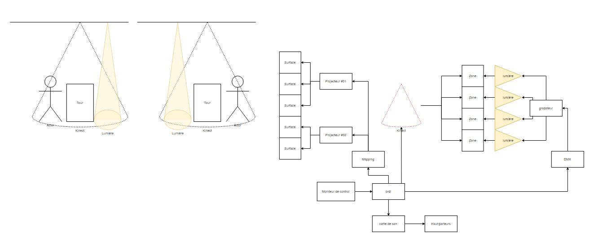
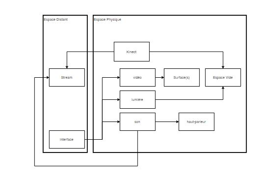
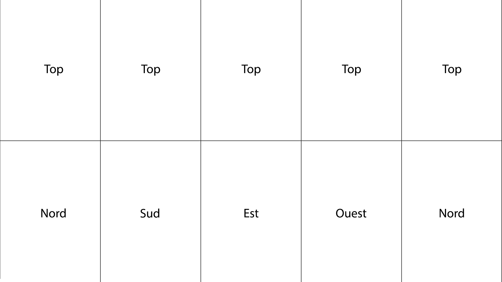
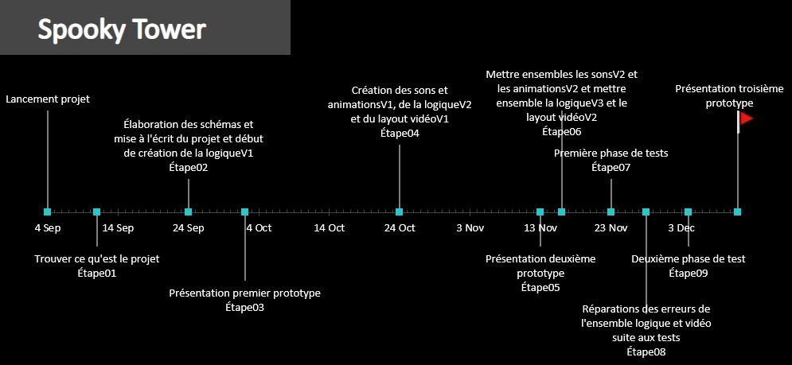

# Spooky-tower bilan d'apprentissage

## Définition du projet de départ
Notre idée s’est trouvée relativement rapidement, nous avons brainstorm dès l’annonce du projet, et après la première discussion nous avions déjà un thème et une idée de ce que serait notre installation interactive. Spooky Tower est une tour d’environ 1m30 par 80cm possédant cinq faces utilisables, soit le dessus du prisme ainsi que les quatre faces en dessous. Un personnage représentant l’anxiété est présent sur l’une des quatre faces. Il y a aussi quatre zones de participation, soit devant chacune des faces. Le personnage a une phobie des humains et dès qu’un participant est présent dans une des zones et qu’il s’agit de celle où il est réfugié, il s’enfuira rapidement vers une des trois faces restantes. À chaque fois qu’un nouveau participant entre dans la zone où il se trouve, il s’enfuira vers une face libre sans présence et ce jusqu’à ce qu’il y ait une présence dans chacune des zones. Lorsque les quatre zones sont occupées, le personnage n’aura pas le choix d’aller se réfugier sur le dessus de la tour jusqu’à ce qu’un participant se retire et qu’il puisse redescendre sur une face n’ayant aucune présence. 

## Méthodes de travail et participation
L’échange d’idée a été très efficace, car notre projet comporte un grand nombre de sphères d’activités différentes, donc chacun avait une opinion sur une partie du projet. Par exemple, Antoine qui a déjà travaillé dans la construction avait une bonne idée de comment faire la tour et de la disposition physique des éléments, William qui est quelqu’un de très logique a amené des points selon le fonctionnement de la projection, Quentin qui est doué avec la plupart des logiciel amenait déjà des idées sur comment on réaliserait les différentes animations et comment le personnage se déplacerait et Félix amenait des point concernant l’ambiance général du projet autant niveau sonore que visuel. Malgré nos forces, nous étions quand tous capable d’apporter des points dans toutes les différentes étapes.Pour les premières étapes du projet nous avons tout d’abord utilisé draw.io pour faire tous les schémas de connections de l’installation, tout le matériel utilisé et un schéma de comment sera le rendu vidéo de la logique. Ensuite nous avons utilisé Max 8 pour construire la logique ainsi que la sortie vidéo qui sera plus tard projeté sur la tour. Nous avons aussi utilisé Reaper pour créer tous les sons et ambiances, ainsi qu’After Effect pour les animations du personnage. Il y aura d’autres logiciels qui sont prévus à être utiliser dans nos prochaines étapes de production et installation mais que nous n’avons pas encore utilisé pour le prototype 03. Ces logiciels sont, Madmapper, qui servira à projeter les animations sur la tour rectangulaire, OBS, qui servira de support pour envoyer notre projet en direct sur le web puisque qu’une participation en personne ne sera peut-être pas possible et Open Stage Control, qui sera utilisé pour contrôler les haut-parleurs et les lumières en synergie avec Max 8.

## Objectifs et scénario
Selon nos forces nous avons rapidement séparé les tâches en deux catégories, soit le côté ambiance, donc le son, les lumières et les images et le côté logique qui gère quelle action se déclenche à quel moment et comment elle agit. Nous nous sommes séparés en deux équipes, donc William et Antoine s’occupaient du côté technique et logique, tandis que Quentin et Félix s’occupaient du côté ambiance et visuel. Nous avons fait en sorte d’avoir des objectifs qui se suivaient entre les deux membres de chaque équipe, par exemple si la première animation est terminée, les sons qui vont avec devaient l’être aussi. Nous avons adopté une méthode plutôt chronologique qui nous permettait de nous compléter à chaque étape de présentation en mettant les deux parties des travaux ensemble puis faire des tests. Nous avons aussi créé un tableau de suivi pour savoir exactement qui était rendu où et quand. Quant au scénario, il était plutôt clair dès le départ, nous avons fait une liste dès le début d'absolument tous les scénarios possible, autant humains que machine donc nous savions exactement ce qu'il nous fallait comme animations et logique.Nous avions des objectifs clairs pour le prototype 03 depuis le commencement du projet. Certains pourraient dire qu’on aurait pu pousser le tout un peu plus loin, mais nous avions confiance en notre timeline d’objectifs selon nos connaissances avec les logiciels utilisé et la pandémie actuelle et le fait que certains ait plus de risques et de bonnes raisons de ne pas se déplacer inutilement au collège. Nos objectifs suivaient quand même la chronologie de structure du scénario, dans le sens où nous avons commencé par ce qui était le plus urgent et qui nous permettrait d’avancer le mieux en testant régulièrement nos idées et la viabilité du projet final. 

## Scénarimage
Son d’ambiance (01), son de marche (02), son de course (03), son à l’arrêt (04), son à la montée (05), son à la descente (06), animation de marche (07), animation de course (08), animation à l’arrêt (09), animation à la montée (10), animation à la descente (11).

## Médias et fichiers
Tous nos médias sont réunis au même endroit, soit sur notre GitHub ou sur le drive de l’équipe. Ils sont classés de façon à ce que les médias qui doivent s’agencer ensemble (son et vidéo) soit facilement accessible et que leurs noms soient cohérents pour comprendre qu’ils sont complémentaires les uns aux autres. Les médias sont tous à leur taille d’origine et sont redimensionnés directement dans Max 8 où ils sont aussi positionnés sur la grille selon une position prédéfinie qui est ensuite projeter sur la tour. Le classement des fichiers généraux est fait de la même façon que pour les médias, principalement sur GitHub et regroupés de sorte que leur ouverture et compréhension se produit sans soucis.

## Design, navigation et montage
Nous désirons conserver l'ambiance plutôt minimaliste, c'est donc poour cela que nous sommes dirigés en premier lieu vers simplement une tour blanche avec un personnage noir pour le plus de contraste possible ainsi que quatre lumière très simples. Par contre, un point a été amené, que peut-être créer un univers sur la tour pour le personnage sera plus attrayant, nous sommes donc en questionnement par rapport au design de l'ambiance. Pour la navigation, quatre participant auront le choix entre 4 zones délimitées au sol ce qui déclenchera les actions du personnage. Le montage de l'installation n'a pas encore eu lieu, par contre, nous allons penser à ce que l'installation puissent être montée et démontée rapidement puisque nous ne savons pas si nous allons avoir une pièce permanente ou non.

## Technologie, techniques et ressources humaines
Nous avons décidé d'inclure plusieurs technologies pour former un tout, tout d'abord nous avons les capteurs Kinect qui nous permettront de détecter les participants dans les quatre zones différentes. Nous avions pensé à deux capteurs au départ, soit un pour deux zones, mais un seul capteur au dessus de la tour pourrait faire le travail de capter les quatre zones en même temps. Nous aurons aussi des projecteurs qui projeteront à partir de Madmapper. Les deux projecteurs s'occuperont à la fois du dessus de la tour ainsi que deux faces du bas chacune et serons positionnés de façon que le participant ne crée pas d'ombres sur la tour et que les animations ne soit pas trop distortionnées. Il y aura aussi des lumières, soit quatre au dessus de chacune des zones, qui s'éteigneront et s'allumeront selon la présence d'un participant. Pour finir il y aura aussi des hauts-parleurs pour que les sons du personnage le suivent, nous les avions pensés derrière les quatres zones, mais un moyen de les intégrer dans la tour pourrait être mieux pour vraiment avoir l'impression que le personnage produit ses sons et l'ambiance proviendrait aussi de la tour. Les lumières et les haut-parleurs serait gérés par Open Stage Control ainsi que par Max 8. Plusieurs éléments techniques sont à penser, comme par exemple, les ombres des projecteurs, si on met des installations dans la tour il faut faire attention pour le risque de chaleur, plusieurs logiciels seront reliés entre eux, donc il faut avoir une console pratique où tout serait facilement accessible et la position des projecteurs pourrait être problématique à cause de la distortion créer par l'angle. Il y aura aussi le fait que notre installation devra pouvoir être utilisé en direct sur le Web grâce à OBS et un système de vote pour déterminer quelle zone sera occupée par un participant. Vu que nous ne sommes pas encore en phase d'installation nous sommes conscient que d'autres contraintes dont nous n'avons pas pensé apparaîtront, mais nous allons garder du temps spécifiquement pour ce genre de problèmes. Il est important d'avoir un ordinateur fiable parce que plusieurs logiciels performeront en même temps et si un seul élément fait défaut, c'est toute l'installation qui doit être arrêtée. Nous effectueront aussi des pauses pour que les différents éléments ne soient pas surutilisés, car beaucoup d'entre eux dégagent beaucoup de chaleur (projecteurs) ou ne se sont pas fait pour être utilisé un grand nombre d'heures de suite (kinect). Les ressources humaines dépendent de comment nous gérons le projets en lignes, car les trois possibilités seraient que selon les votes en ligne, un membre de l'équipe se placerait lui-même dans la zone choisie et ce pour toutes les zones, ce qui nécessiterait au moins cinq personnes parce qu'une personne devra toujours rester devant les contrôles pour s'assurer que tout fonctionne. La deuxième possibilité serait de mettre quelque chose, un genre de mannequin dans les zones pour représenter les participants, ce qui nous permettrait d'avoir un visuel, mais aussi seulement deux personnes pourraient gérer le projet, soit une qui place les mannequins et l'autre qui gère la console. La dernière option serait tout simplement de ne rien mettre dans les zones, mais de gérer les présences à partir de Max sur l'ordinateur, ce qui nécessiterait qu'une seule personne, mais serait moins intéressant au niveau visuel.

## Programmation et schématisation
La programmation était surtout réalisée sur Max 8 en même temps que la logique, mais il restera aussi plusieurs éléments à programmer ensemble pour que le tout soit fonctionnel comme étant un seul projet. Comme on peut le voir sur les schémas ci-dessous, il faudra programmer les lumières et le sons sur Open Stage Control mais aussi à partir de Max pour que tout démarre automatiquement et simultanément que les animations qui seront aussi programmées à partir de Max et ensuite envoyées aux projecteurs respectifs. 

## Ajustement du scénario
Le scénario en tant que tel n'a pas changé énormément et reste très proche de l'idée de départ, ce qui a le plus changé est le côté technique. Par exemple, dans notre première version, nous avions cinq projecteurs, quatre Kinects, mais après recommandations nous avons découvert qu'une seule Kinect qui détecterait les quatre zones en même temps était possible et que seulement deux projecteurs pourraient être nécessaires pour l'entierté du projet. Nous avons effectué quelques changements au niveau du déplacement du personnage grâce au layout vidéo et aux dix possibilités qui nous enlève la charge de faire jouer deux animation en même temps pour passer de la face ouest à nord ou du top à une face de bas.

## Échéancier de production
Il nous reste encore beaucoup à prévoir pour l'installation à la prochaine session, mais cette session nous avons respecté notre échéancier de production la plupart du temps. Il n'y a que pour le prototype 03 que nous n'avons pas été capable d'au moins intégrer les animations à la logique, et ce sera la première étape à faire dans la continuité du projet. Comme dit plus haut, l'échéancier était fait selon nos sépérations du travail, mais lorsque que la première animation était terminé, le son qui allait avec devait aussi l'être. 

