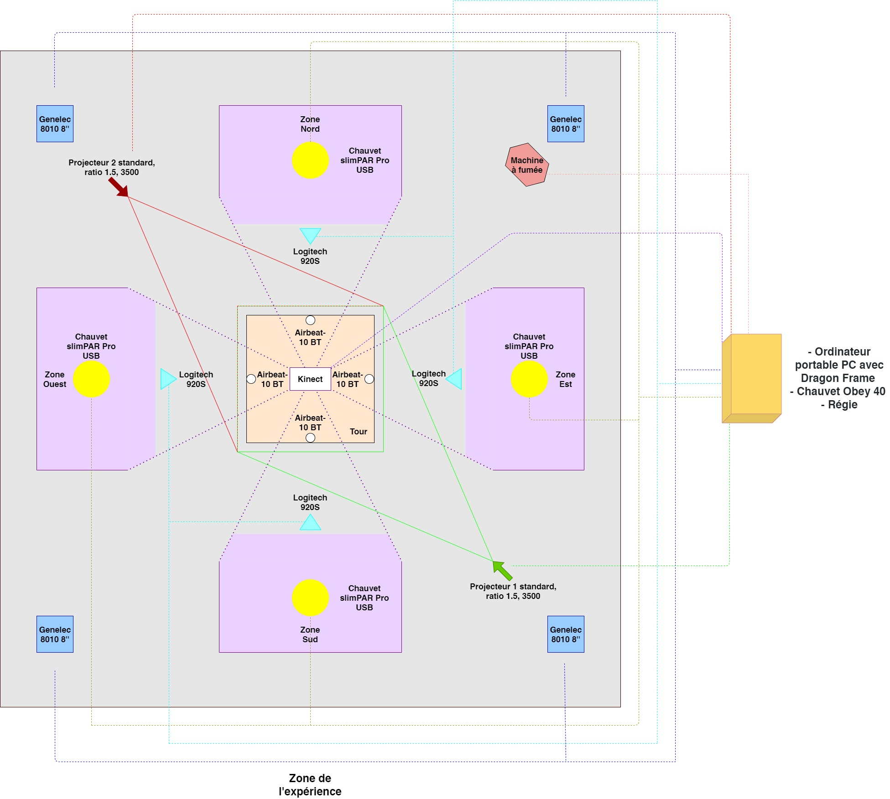
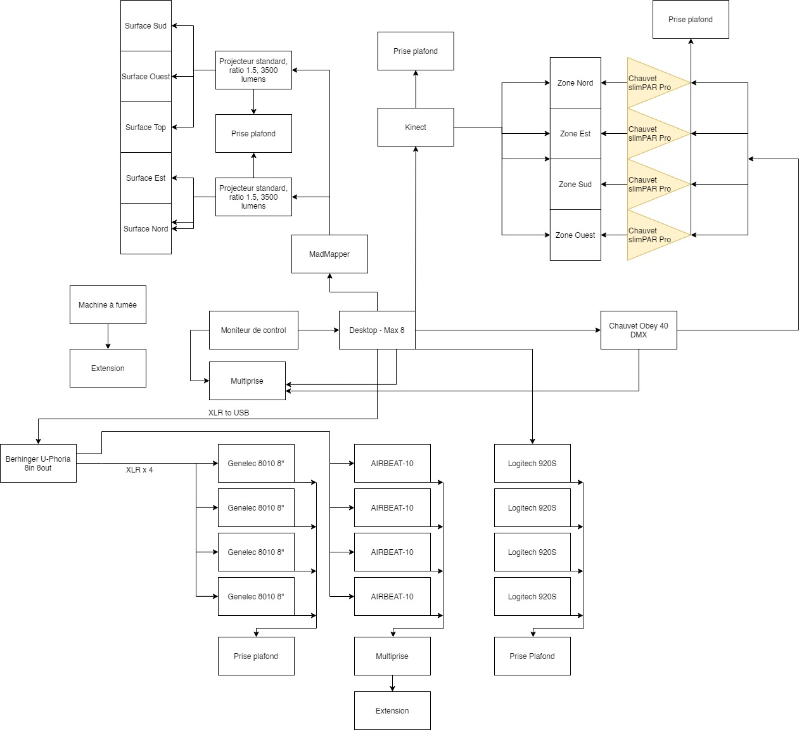
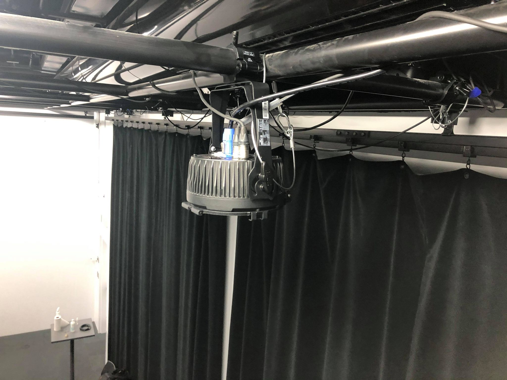
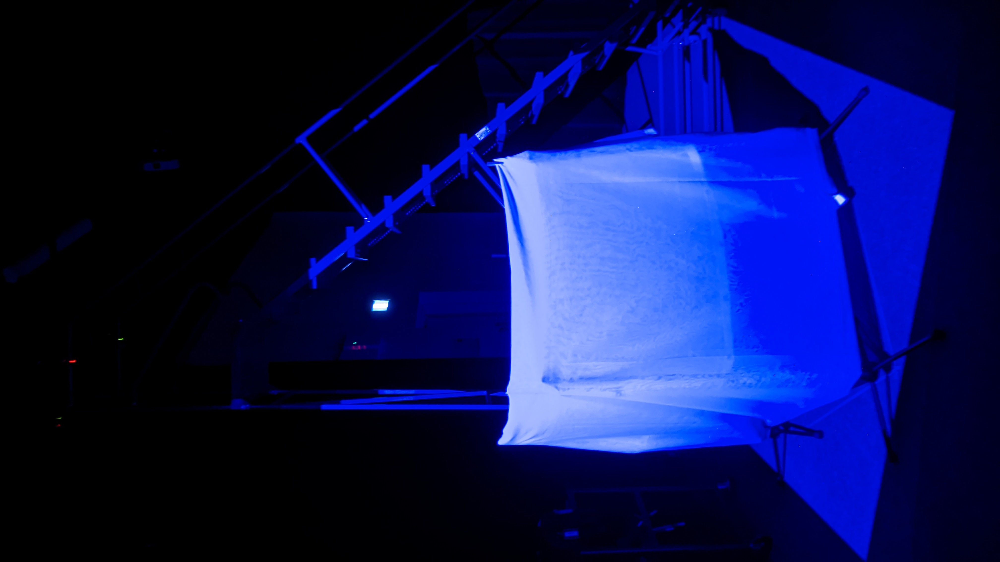
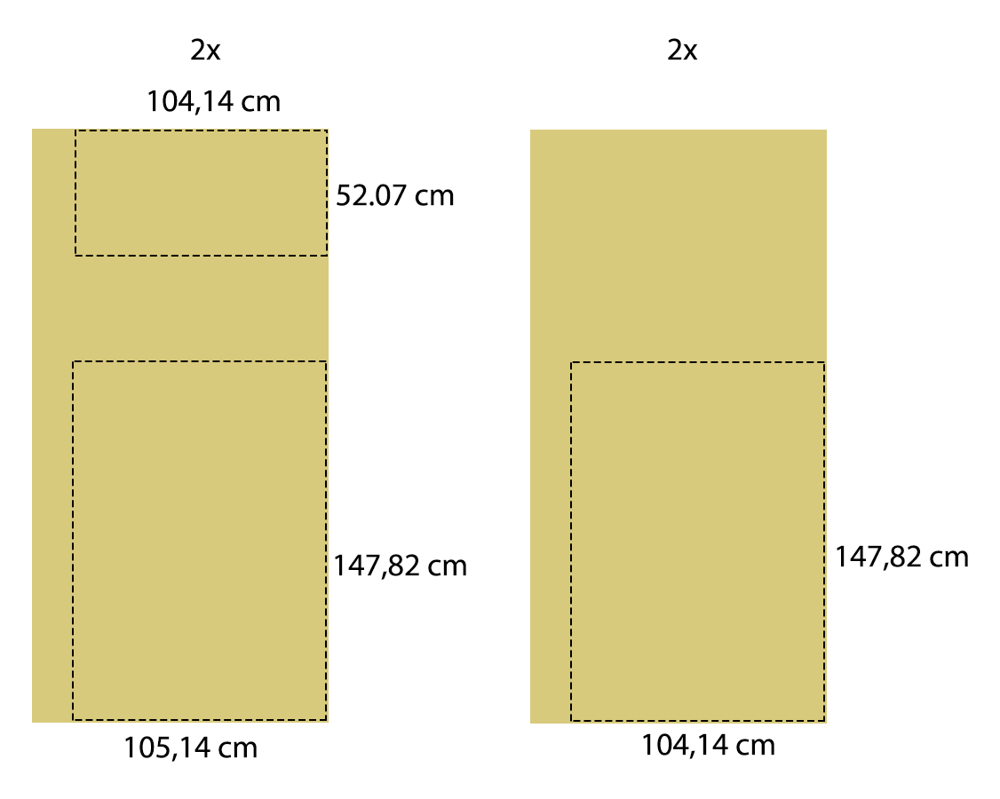

# Journal de Antoine Allard - Coordination technique

## Table des matières
- [Semaine 0 (25 au 29 janvier)](#Semaine-0-(25-au-29-janvier))
- [Semaine 1 (30 janvier au 5 février)](#Semaine-1-(30-janvier-au-5-février))
- [Semaine 2 (6 au 12 février)](#Semaine-2-(6-au-12-février))
- [Semaine 3 (13 au 19 février)](#Semaine-3-(13-au-19-février))
- [Semaine 4 (20 au 26 février)](#Semaine-4-(20-au-26-février))
- [Semaine 5 (6 au 12 mars)](#Semaine-5-(6-au-12-mars))
- [Semaine 6 (13 au 19 mars)](#Semaine-6-(13-au-19-mars))

---
## Semaine 0 (25 au 29 janvier)

### Résumé des réalisations effectuées
- Détermination des rôles
- Création du Journal personnel
- Mise à jour du schéma de branchement
- Schéma de plantation
- Plan de la tour
- Détermination des équipements et logiciels

### Image d'une réalisation dont tu es la ou le plus fier

### Est-ce que j'ai accompli l'ensemble des tâches et objectifs que je m'étais fixés pour cette semaine?	
- [ ] Complètement
- [X] Assez
- [ ] Peu
- [ ] Pas du tout

#### Décrivez pourquoi.

Je n'ai pas complété mon journal à temps.

#### S'il y a lieu, qu'allez-vous faire pour remédier à la situation?

Faire mon journal le jeudi absolument à l'avenir.

### Mon projet s'est-il réalisé selon l’échéancier prévu?

- [X] Complètement
- [ ] Assez
- [ ] Un peu
- [ ] Pas tout à fait

#### S'il y a des écarts, décrivez-les.

Je ne suis pas encore certain à 100% des équipements en électricité et en réseau.

#### S'il y a lieu, qu'allez-vous faire pour remédier à la situation?

Faire une rencontre privé avec les professeurs vu qu'il n'y avait pas de réunion technique.

### Défis pour la prochaine semaine

Avoir fini la préproduction et ainsi connaître tous les équipements nécessaires.

---
## Semaine 1 (30 janvier au 5 février)
### Résumé des réalisations effectuées

- Avoir fini tous les plans détaillés
- Avoir une liste de tout l'équipements
- Avoir participé au comité technique
- Préproduction presque complété
- Rendez-vous avec professeurs et TTP

### Image d'une réalisation dont tu es la ou le plus fier

### Est-ce que j'ai accompli l'ensemble des tâches et objectifs que je m'étais fixés pour cette semaine?

- [ ] Complètement
- [x] Assez
- [ ] Peu
- [ ] Pas du tout

#### Décrivez pourquoi.
 
Je n'ai pas complété la préproduction à 100%.

#### S'il y a lieu, qu'allez-vous faire pour remédier à la situation?

La finir cette fin de semaine, les plans et équipements ont pris plus de temps que prévu.

### Mon projet s'est-il réalisé selon l’échéancier prévu?

- [x] Complètement
- [ ] Assez
- [ ] Un peu
- [ ] Pas tout à fait

#### S'il y a des écarts, décrivez-les.

Pas vraiment d'écart, mais certains équipements sont encore à décider (surtout au niveau du câblage et de la diffusion).

#### S'il y a lieu, qu'allez-vous faire pour remédier à la situation?

 J'ai un rendez-vous avec Cédrick à 14h vendredi finaliser nos équipements.

### Défis pour la prochaine semaine

Avoir fini la préproduction pour mardi et prendre possession d'une partie de notre matériel.

---
## Semaine 2 (6 au 12 février)
### Résumé des réalisations effectuées

- Présentation de la préproduction
- Mise à jour de la préproduction
- Acquisition du matériel
- Acquisition de l'espace pour l'expérience
- Tests et assemblage d'équipements

### Image d'une réalisation dont tu es la ou le plus fier

### Est-ce que j'ai accompli l'ensemble des tâches et objectifs que je m'étais fixés pour cette semaine?

- [x] Complètement
- [ ] Assez
- [ ] Peu
- [ ] Pas du tout

#### Décrivez pourquoi.
 
La présentation de la préproduction était claire et précise, et les mises à jour suite aux commentaires ont été effectuées tout de suite après la rencontre. J'ai aussi géré l'acquisition du matériel et je me suis assuré de tout avoir selon notre plan théorique.

#### S'il y a lieu, qu'allez-vous faire pour remédier à la situation?

### Mon projet s'est-il réalisé selon l’échéancier prévu?

- [ ] Complètement
- [x] Assez
- [ ] Un peu
- [ ] Pas tout à fait

#### S'il y a des écarts, décrivez-les.

Nous avions prévu faire des tests avec Madmapper ou de la projection, mais il y a eu une plus grande adaptation au niveau de l'équipement et de l'emplacement physique. Par exemple, les lumières n'étaient pas les bonnes pour faire des spots sur le sol.

#### S'il y a lieu, qu'allez-vous faire pour remédier à la situation?

Nous avons déjà effectué un deuxième checkup complet du matériel, donc nous devrions avoir tout pour mettre l'expérience en place.

### Défis pour la prochaine semaine

Effectuer différents tests de projection, ainsi que s'entendre sur la position et la dimension exactes de la tour.

---
## Semaine 3 (13 au 19 février)
### Résumé des réalisations effectuées

- Implantation de la tour dans l'espace
- Détermination de l'emplacement des projecteurs

### Image d'une réalisation dont tu es la ou le plus fier

### Est-ce que j'ai accompli l'ensemble des tâches et objectifs que je m'étais fixés pour cette semaine?

- [ ] Complètement
- [x] Assez
- [ ] Peu
- [ ] Pas du tout

#### Décrivez pourquoi.
 
Car l'installation des projecteurs a été plus longue que prévu et donc il reste quelques trucs à installer pour présenter le prototype.

#### S'il y a lieu, qu'allez-vous faire pour remédier à la situation?

Aujourd'hui, vendredi, nous continuons l'installation, ainsi que lundi où nous testerons aussi les équipements en envoyant des signaux

### Mon projet s'est-il réalisé selon l’échéancier prévu?

- [x] Complètement
- [ ] Assez
- [ ] Un peu
- [ ] Pas tout à fait

#### S'il y a des écarts, décrivez-les.

Il n'y a pas de retard dans l'échéancier du projet, nous suivons tout de même bien notre roadmap.

#### S'il y a lieu, qu'allez-vous faire pour remédier à la situation?

### Défis pour la prochaine semaine

- Envoyer des signaux pour tester tous les équipements
- Commencer la conception de la tour
- Présenter le prototype

---
## Semaine 4 (20 au 26 février)
### Résumé des réalisations effectuées

- Tests de spots de lumière
- Tests des hauts-parleurs divoom
- Présentation prototype 01

### Image d'une réalisation dont tu es la ou le plus fier

### Est-ce que j'ai accompli l'ensemble des tâches et objectifs que je m'étais fixés pour cette semaine?

- [x] Complètement
- [ ] Assez
- [ ] Peu
- [ ] Pas du tout

#### Décrivez pourquoi.

Notre prototype 01 était relativement assez complet, surtout du fait que du mapping était fait sur notre tour test.

#### S'il y a lieu, qu'allez-vous faire pour remédier à la situation?

### Mon projet s'est-il réalisé selon l’échéancier prévu?

- [ ] Complètement
- [x] Assez
- [ ] Un peu
- [ ] Pas tout à fait

#### S'il y a des écarts, décrivez-les.

Le manque d'équipement nous ralentit un peu, car on ne veut pas se lancer dans des choses sans faire de tests et devoir démonter plusieurs fois comme pour les lumières et les projecteurs.

#### S'il y a lieu, qu'allez-vous faire pour remédier à la situation?

Installer quand même des équipements pour accrochage et tester avec d'autres équipements en attendant de recevoir ce qu'il faut.

### Défis pour la prochaine semaine

- Avoir une tour quasiment sinon complètement finie
- Avoir installer les systèmes d'accrochage pour les hauts-parleurs et caméras

---
## Semaine de rattrapage (27 février au 5 mars)
### Résumé des réalisations effectuées

### Image d'une réalisation dont tu es la ou le plus fier

### Est-ce que j'ai accompli l'ensemble des tâches et objectifs que je m'étais fixés pour cette semaine?

- [ ] Complètement
- [ ] Assez
- [ ] Peu
- [ ] Pas du tout

#### Décrivez pourquoi.
 

#### S'il y a lieu, qu'allez-vous faire pour remédier à la situation?

### Mon projet s'est-il réalisé selon l’échéancier prévu?

- [ ] Complètement
- [ ] Assez
- [ ] Un peu
- [ ] Pas tout à fait

#### S'il y a des écarts, décrivez-les.

#### S'il y a lieu, qu'allez-vous faire pour remédier à la situation?

### Défis pour la prochaine semaine

---
## Semaine 5 (6 au 12 mars)
### Résumé des réalisations effectuées

### Image d'une réalisation dont tu es la ou le plus fier

### Est-ce que j'ai accompli l'ensemble des tâches et objectifs que je m'étais fixés pour cette semaine?

- [ ] Complètement
- [ ] Assez
- [ ] Peu
- [ ] Pas du tout

#### Décrivez pourquoi.
 

#### S'il y a lieu, qu'allez-vous faire pour remédier à la situation?

### Mon projet s'est-il réalisé selon l’échéancier prévu?

- [ ] Complètement
- [ ] Assez
- [ ] Un peu
- [ ] Pas tout à fait

#### S'il y a des écarts, décrivez-les.

#### S'il y a lieu, qu'allez-vous faire pour remédier à la situation?

### Défis pour la prochaine semaine

---
## Semaine 6 (13 au 19 mars)
### Résumé des réalisations effectuées

### Image d'une réalisation dont tu es la ou le plus fier

### Est-ce que j'ai accompli l'ensemble des tâches et objectifs que je m'étais fixés pour cette semaine?

- [ ] Complètement
- [ ] Assez
- [ ] Peu
- [ ] Pas du tout

#### Décrivez pourquoi.
 

#### S'il y a lieu, qu'allez-vous faire pour remédier à la situation?

### Mon projet s'est-il réalisé selon l’échéancier prévu?

- [ ] Complètement
- [ ] Assez
- [ ] Un peu
- [ ] Pas tout à fait

#### S'il y a des écarts, décrivez-les.

#### S'il y a lieu, qu'allez-vous faire pour remédier à la situation?

### Défis pour la prochaine semaine
