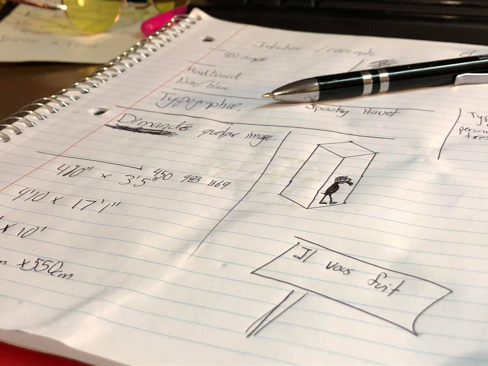
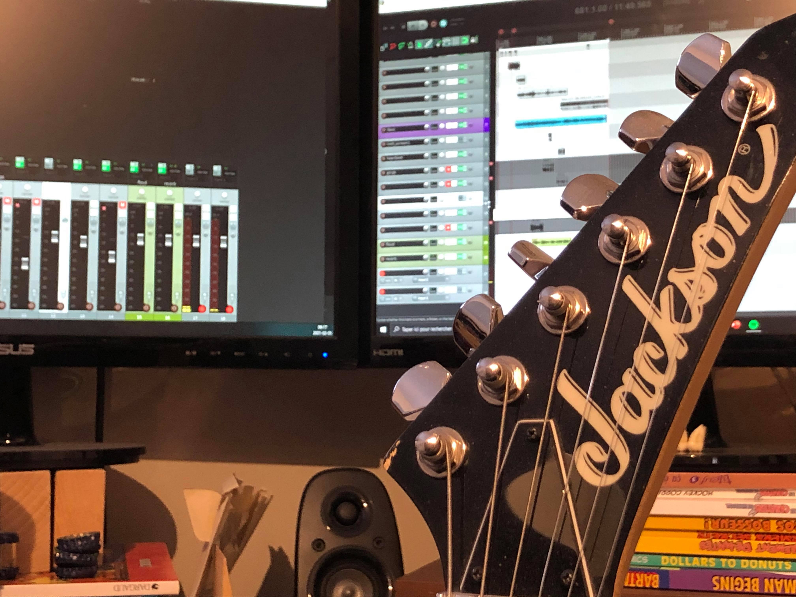
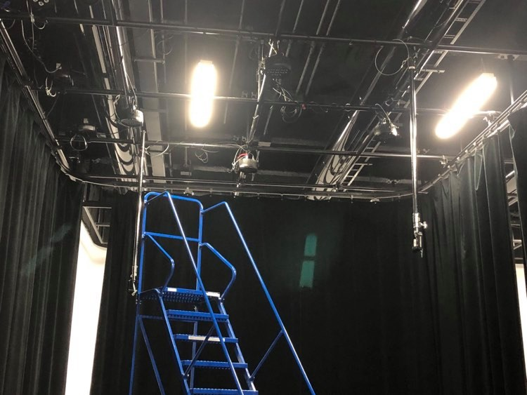
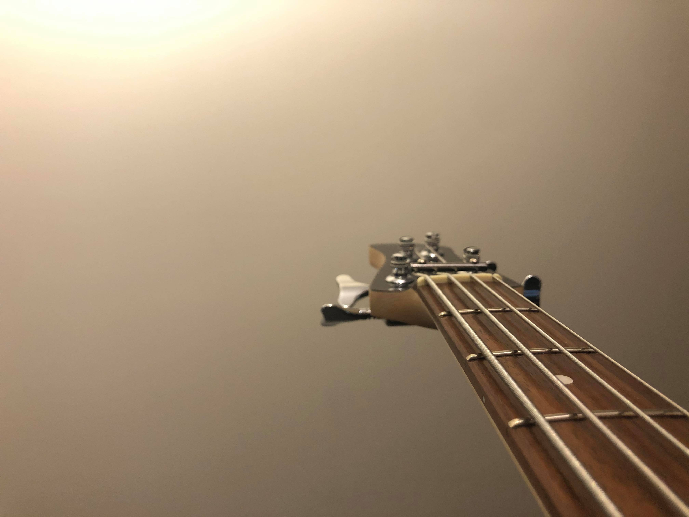
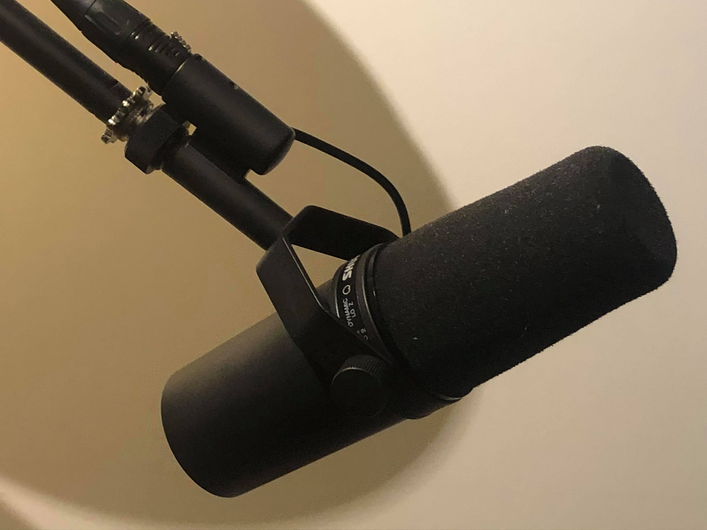
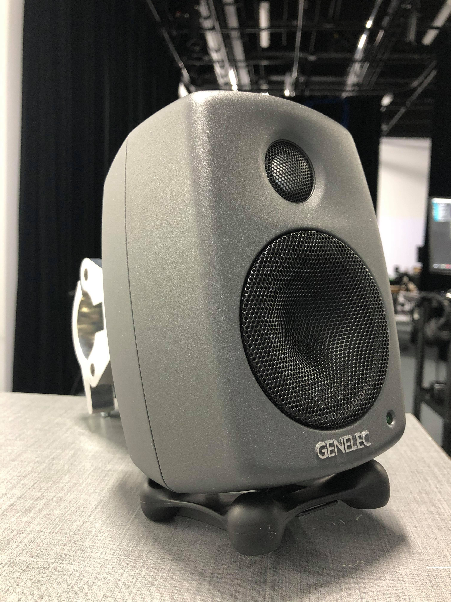

# Journal de Félix Jasmin

## Table des matières
- [Semaine 0 (25 au 29 janvier)](#Semaine-0-(25-au-29-janvier))
- [Semaine 1 (30 janvier au 5 février)](#Semaine-1-(30-janvier-au-5-février))
- [Semaine 2 (6 au 12 février)](#Semaine-2-(6-au-12-février))
- [Semaine 3 (13 au 19 février)](#Semaine-3-(13-au-19-février))
- [Semaine 4 (20 au 26 février)](#Semaine-4-(20-au-26-février))
- [Semaine 5 (6 au 12 mars)](#Semaine-5-(6-au-12-mars))
- [Semaine 6 (13 au 19 mars)](#Semaine-6-(13-au-19-mars))

---
### Résumé des tâches global à faire
Étudiant B

-Coordination artistique (attention plus particulière pour s'assurer que l'intention/concept artistique du projet initial reste, sinon consulter les membres de l'équipe);
-Création des textes poétiques;
-Création des vidéos d'animation 2D;
-Programmation du module Unity d'effets visuels et intégration dans Max.

## Semaine 0 (25 au 29 janvier)

### Résumé des réalisations effectuées
-Moodboard
-Scénario/ explication du fonctionnement
-Faire des issues

### Image d'une réalisation dont tu es la ou le plus fier

### Est-ce que j'ai accompli l'ensemble des tâches et objectifs que je m'étais fixés pour cette semaine?	
- [ ] Complètement
- [X] Assez
- [ ] Peu
- [ ] Pas du tout

#### Décrivez pourquoi.
Je considère que j'ai complèté adéquatement les tâches qui m'étaient assigné. Par contre, je n'ai pas écris d'Issues encore. 

#### S'il y a lieu, qu'allez-vous faire pour remédier à la situation?
Je prévois faire plus d'Issues ( et trouvé des solutions) pour les prochaines semaines. 

### Mon projet s'est-il réalisé selon l’échéancier prévu?

- [X] Complètement
- [ ] Assez
- [ ] Un peu
- [ ] Pas tout à fait

### Défis pour la prochaine semaine
Me concentrer sur l'Issues concernant les haut-parleurs.

---
## Semaine 1 (30 janvier au 5 février)
### Résumé des réalisations effectuées
-Appeler à la boutique de tissu pour avoir certain renseignement
-Trouvé une solution pour le positionnement des speakers
-Finalisé le moodboard ( amener les corrections à avoir)
-Retravailler la musique d'ambiance

### Image d'une réalisation dont tu es la ou le plus fier

Mes principaux outils en ce moment

### Est-ce que j'ai accompli l'ensemble des tâches et objectifs que je m'étais fixés pour cette semaine?

- [ ] Complètement
- [ ] Assez
- [ X ] Peu
- [ ] Pas du tout

#### Décrivez pourquoi.
 J'ai eu un empêchement cette semaine et ça m'a fait prendre un peu de retard malheureusement. J'ai tout de même retravaillé sur la musique d'ambiance et travaillé sur le moodboard.

#### S'il y a lieu, qu'allez-vous faire pour remédier à la situation?
Rattraper mon retard en travaillant sur le projet en fin de semaine.

### Mon projet s'est-il réalisé selon l’échéancier prévu?

- [ ] Complètement
- [ X ] Assez
- [ ] Un peu
- [ ] Pas tout à fait

#### S'il y a des écarts, décrivez-les.
N/A

#### S'il y a lieu, qu'allez-vous faire pour remédier à la situation?
N/A

### Défis pour la prochaine semaine
Se rendre au studio et commencé à travailler sur notre scène.

---
## Semaine 2 (6 au 12 février)
### Résumé des réalisations effectuées
Nous avons présenté la préproduction. Nous nous sentions plutôt prêt pour la présentation et sommes fier de nous.
Cette semaine on s'ait rendu au studio et on a commencé à monter les projecteurs et les lumières. On a commencé à faire plusieurs testes notamment avec les projecteurs.

### Image d'une réalisation dont tu es la ou le plus fier

### Est-ce que j'ai accompli l'ensemble des tâches et objectifs que je m'étais fixés pour cette semaine?

- [ X ] Complètement
- [ ] Assez
- [ ] Peu
- [ ] Pas du tout

#### Décrivez pourquoi.
Nous avons eux un bon retour par rapport à la présentation de la préproduction et nous avons commencé à faire le montage dans le grand studio. Nous respectons notre échéancier et le déroulement général du montage dans le grand studio ce passe assez bien jusqu'à maintenant.

#### S'il y a lieu, qu'allez-vous faire pour remédier à la situation?
--- Ça va bien.

### Mon projet s'est-il réalisé selon l’échéancier prévu?

- [ X ] Complètement
- [ ] Assez
- [ ] Un peu
- [ ] Pas tout à fait

#### S'il y a des écarts, décrivez-les.
N/A
#### S'il y a lieu, qu'allez-vous faire pour remédier à la situation?
N/A

### Défis pour la prochaine semaine
Continuer à faire le montage dans le grand studio. Je crois qu'il serait vraiment important de completé un maximum de teste avec les projecteurs car ça semble être notre plus grand enjeu pour le moment. Si le temps nous le permet, ça serait plutôt bien de commencer à monter l'équipement pour l'aspect sonnor du projet.
---
## Semaine 3 (13 au 19 février)
### Résumé des réalisations effectuées
Avancement de la musique d'ambiance

### Image d'une réalisation dont tu es la ou le plus fier

### Est-ce que j'ai accompli l'ensemble des tâches et objectifs que je m'étais fixés pour cette semaine?

- [ ] Complètement
- [ ] Assez
- [ ] Peu
- [ X ] Pas du tout

#### Décrivez pourquoi.
 J'ai été malade en début de semaine. J'ai préféré rester à la maison pour des raisons évidente. Mes tâches ont considérablement été ralentis. 

#### S'il y a lieu, qu'allez-vous faire pour remédier à la situation?
Je prévois travailler de jour et de soir notre projet pour rattraper le temps perdu.

### Mon projet s'est-il réalisé selon l’échéancier prévu?

- [ ] Complètement
- [ ] Assez
- [ ] Un peu
- [ X ] Pas tout à fait

#### S'il y a des écarts, décrivez-les.
J'aurais aimé avancé plus la musique, mais j'ai eu plusieur problème de latence et ça m'a durement ralentis. 

#### S'il y a lieu, qu'allez-vous faire pour remédier à la situation?
Règler le problème de latence le plus rapidement possible.

### Défis pour la prochaine semaine
-Installer les haut-parleurs
-Effectuer des testes de sons
-Avancer la musique d'ambiance
-Installer les spotlight

---
## Semaine 4 (20 au 26 février)
### Résumé des réalisations effectuées
-Nous avons présenté le protype 1
-Nous avons commencé à faire des testes de sons
-Enrgistrement de la musique d'ambiance qui était à refaire.
-Installation des spotlights

### Image d'une réalisation dont tu es la ou le plus fier

### Est-ce que j'ai accompli l'ensemble des tâches et objectifs que je m'étais fixés pour cette semaine?

- [ ] Complètement
- [ X ] Assez
- [ ] Peu
- [ ] Pas du tout

#### Décrivez pourquoi.
Oui, nous avons même fait plus que prévue. Un progrès qui a été le plus important est d'avoir règler le problème de latence avec ma carte de son avec Daryl. Ça m'a vraiment aidé à enregistrer de façon approprié. J'ai donc vraiment bien avancé la musique d'ambiance et j'en suis content. 
 

#### S'il y a lieu, qu'allez-vous faire pour remédier à la situation?
N/A

### Mon projet s'est-il réalisé selon l’échéancier prévu?

- [ X ] Complètement
- [ ] Assez
- [ ] Un peu
- [ ] Pas tout à fait

#### S'il y a des écarts, décrivez-les.
N/A

#### S'il y a lieu, qu'allez-vous faire pour remédier à la situation?
N/A

### Défis pour la prochaine semaine
-Installer les haut-parleurs
-Avoir fini la musique d'ambiance
-Effectuer les testes de sons avec les speakers
-Installer les pôles de support

---
## Semaine de rattrapage (27 février au 5 mars)
### Résumé des réalisations effectuées
-La musique d'ambiance est officiellement terminé
-Les bruits qui accompagnent les spotlights sont officiellement terminé
-Les pinces d'accrochage des Genelecs sont installer sur les Genelecs.
-Un Genelec a été accroché sur la grille au plafond.

### Image d'une réalisation dont tu es la ou le plus fier

### Est-ce que j'ai accompli l'ensemble des tâches et objectifs que je m'étais fixés pour cette semaine?

- [ ] Complètement
- [  ] Assez
- [ X ] Peu
- [ ] Pas du tout

#### Décrivez pourquoi.
Je n'ai pas pu réalisé tout les tâches désiré car le collège n'avait pas encore reçu tout le matériel nécéssaire. 

#### S'il y a lieu, qu'allez-vous faire pour remédier à la situation?
Nous allons passer plus de temps au collège cette semaine maintenant que nous avons tout reçu le matériel nécessaire.

### Mon projet s'est-il réalisé selon l’échéancier prévu?

- [ ] Complètement
- [ ] Assez
- [ X ] Un peu
- [ ] Pas tout à fait

#### S'il y a des écarts, décrivez-les.
Encore une fois, c'est à cause du matériel qui était manquant.

#### S'il y a lieu, qu'allez-vous faire pour remédier à la situation?
N/A

### Défis pour la prochaine semaine
-Installer les haut-parleurs
-Installer la 2e cartes de sons avec 8 entrés
-Effectuer les testes de sons avec les speakers

---
## Semaine 5 (6 au 12 mars)
### Résumé des réalisations effectuées

### Image d'une réalisation dont tu es la ou le plus fier

### Est-ce que j'ai accompli l'ensemble des tâches et objectifs que je m'étais fixés pour cette semaine?

- [ ] Complètement
- [ ] Assez
- [ ] Peu
- [ ] Pas du tout

#### Décrivez pourquoi.
 

#### S'il y a lieu, qu'allez-vous faire pour remédier à la situation?

### Mon projet s'est-il réalisé selon l’échéancier prévu?

- [ ] Complètement
- [ ] Assez
- [ ] Un peu
- [ ] Pas tout à fait

#### S'il y a des écarts, décrivez-les.

#### S'il y a lieu, qu'allez-vous faire pour remédier à la situation?

### Défis pour la prochaine semaine

---
## Semaine 6 (13 au 19 mars)
### Résumé des réalisations effectuées

### Image d'une réalisation dont tu es la ou le plus fier

### Est-ce que j'ai accompli l'ensemble des tâches et objectifs que je m'étais fixés pour cette semaine?

- [ ] Complètement
- [ ] Assez
- [ ] Peu
- [ ] Pas du tout

#### Décrivez pourquoi.
 

#### S'il y a lieu, qu'allez-vous faire pour remédier à la situation?

### Mon projet s'est-il réalisé selon l’échéancier prévu?

- [ ] Complètement
- [ ] Assez
- [ ] Un peu
- [ ] Pas tout à fait

#### S'il y a des écarts, décrivez-les.

#### S'il y a lieu, qu'allez-vous faire pour remédier à la situation?

### Défis pour la prochaine semaine

Teste
