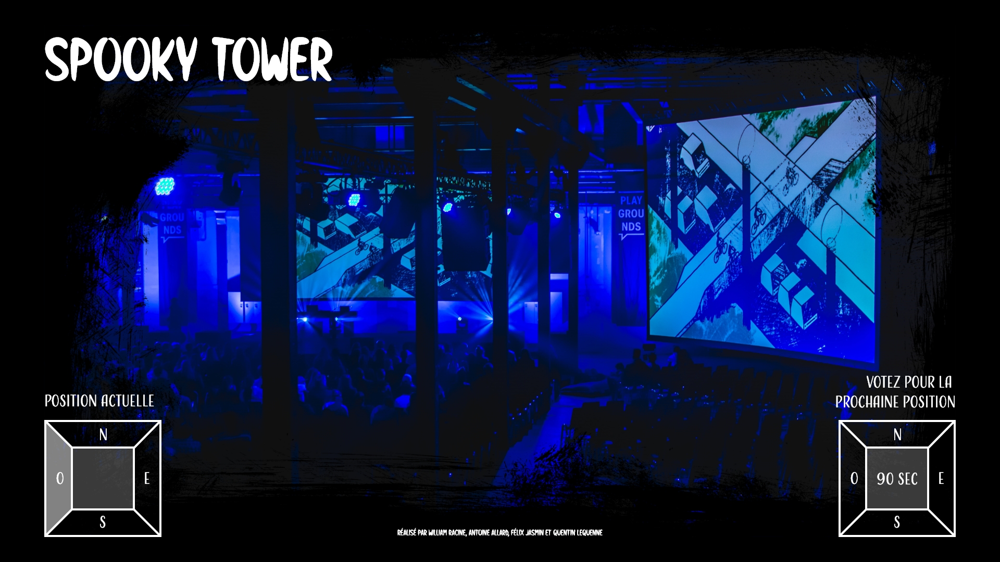
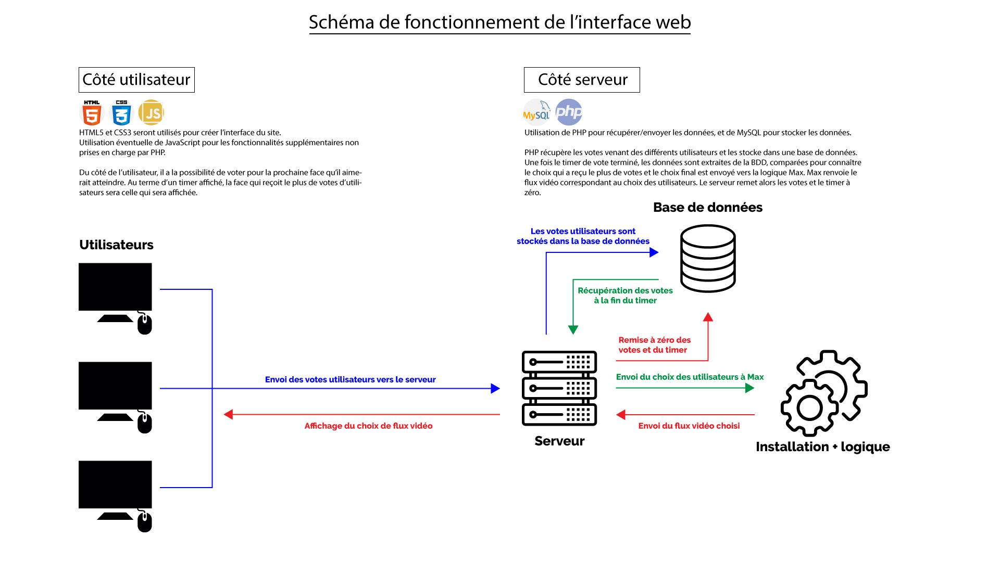
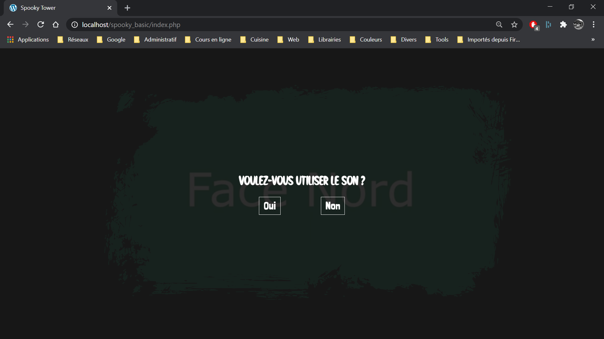

# Journal de Quentin Lequenne

## Table des matières
- [Semaine 0 (25 au 29 janvier)](#Semaine-0-(25-au-29-janvier))
- [Semaine 1 (30 janvier au 5 février)](#Semaine-1-(30-janvier-au-5-février))
- [Semaine 2 (6 au 12 février)](#Semaine-2-(6-au-12-février))
- [Semaine 3 (13 au 19 février)](#Semaine-3-(13-au-19-février))
- [Semaine 4 (20 au 26 février)](#Semaine-4-(20-au-26-février))
- [Semaine 5 (6 au 12 mars)](#Semaine-5-(6-au-12-mars))
- [Semaine 6 (13 au 19 mars)](#Semaine-6-(13-au-19-mars))

---
### Résumé des tâches globales à faire
- Inventaire du contenu multimédia
- Réalisation d'une maquette de l'interface web
- Réalisation du front end de l'interface
- Réalisation du back end de l'interface
- Finitions des animations

## Semaine 0 (25 au 29 janvier)

### Résumé des réalisations effectuées
- Inventaire du contenu multimédia

### Image d'une réalisation dont tu es la ou le plus fier
////

### Est-ce que j'ai accompli l'ensemble des tâches et objectifs que je m'étais fixés pour cette semaine?	
- [ ] Complètement
- [ ] Assez
- [x] Peu
- [ ] Pas du tout

#### Décrivez pourquoi.
Bloqué par la création de la maquette qui contient d'autres contenus non déterminé à date

#### S'il y a lieu, qu'allez-vous faire pour remédier à la situation?
Terminer la maquette

### Mon projet s'est-il réalisé selon l’échéancier prévu?

- [ ] Complètement
- [ ] Assez
- [x] Un peu
- [ ] Pas tout à fait

#### S'il y a des écarts, décrivez-les.
Manque du contenu multimédia

#### S'il y a lieu, qu'allez-vous faire pour remédier à la situation?
Travail ce weekend

### Défis pour la prochaine semaine
- Inventaire du contenu multimédia
- Réalisation d'une maquette de l'interface web

---
## Semaine 1 (30 janvier au 5 février)
### Résumé des réalisations effectuées
- Inventaire du contenu multimédia
- Réalisation d'une maquette de l'interface web
- Préparation de l'espace qui accueillera le site de diffusion (achat nom de domaine, liaison au serveur, tests de mise en ligne - http://spookytower.ca/ )

### Image d'une réalisation dont tu es la ou le plus fier

### Est-ce que j'ai accompli l'ensemble des tâches et objectifs que je m'étais fixés pour cette semaine?

- [x] Complètement
- [ ] Assez
- [ ] Peu
- [ ] Pas du tout

#### Décrivez pourquoi.
Bonne gestion de la repartition des tâches dans l'équipe et de mon temps de travail me permet d'avancer efficacement

#### S'il y a lieu, qu'allez-vous faire pour remédier à la situation?
/

### Mon projet s'est-il réalisé selon l’échéancier prévu?

- [x] Complètement
- [ ] Assez
- [ ] Un peu
- [ ] Pas tout à fait

#### S'il y a des écarts, décrivez-les.
Avance sur mon échéancier

#### S'il y a lieu, qu'allez-vous faire pour remédier à la situation?
/

### Défis pour la prochaine semaine
- Réalisation d'un schéma de mon code pour déterminer le langage le plus approprié aux différentes fonctions de l'interface
- Détermination des langages à utiliser
- Création de deadlines pour les différentes parties du code

---
## Semaine 2 (6 au 12 février)
### Résumé des réalisations effectuées
- Réalisation d'un schéma de mon code pour déterminer le langage le plus approprié aux différentes fonctions de l'interface
- Détermination des langages à utiliser
- Création de deadlines pour les différentes parties du code
### Image d'une réalisation dont tu es la ou le plus fier

### Est-ce que j'ai accompli l'ensemble des tâches et objectifs que je m'étais fixés pour cette semaine?

- [x] Complètement
- [ ] Assez
- [ ] Peu
- [ ] Pas du tout

#### Décrivez pourquoi.
Charge de travail assez légère

#### S'il y a lieu, qu'allez-vous faire pour remédier à la situation?
/

### Mon projet s'est-il réalisé selon l’échéancier prévu?

- [x] Complètement
- [ ] Assez
- [ ] Un peu
- [ ] Pas tout à fait

#### S'il y a des écarts, décrivez-les.
/

#### S'il y a lieu, qu'allez-vous faire pour remédier à la situation?
/

### Défis pour la prochaine semaine
- Réalisation du HTML/CSS de l'interface simplifiée
- Réalisation du JavaScript de l'interface simplifiée
- Prise de renseignements sur la meilleure façon de diffuser les flux vidéos en ligne
- Tests de diffusion en ligne
---
## Semaine 3 (13 au 19 février)
### Résumé des réalisations effectuées
- Réalisation du HTML/CSS de l'interface simplifiée
- Réalisation du JavaScript de l'interface simplifiée
- Prise de renseignements sur la meilleure façon de diffuser les flux vidéos en ligne
- Tests de diffusion en ligne
- Rajout du son dans l'interface

### Image d'une réalisation dont tu es la ou le plus fier

### Est-ce que j'ai accompli l'ensemble des tâches et objectifs que je m'étais fixés pour cette semaine?

- [x] Complètement
- [ ] Assez
- [ ] Peu
- [ ] Pas du tout

#### Décrivez pourquoi.
Toutes les tâches prévues cette semaine ont été réalisées

#### S'il y a lieu, qu'allez-vous faire pour remédier à la situation?
/

### Mon projet s'est-il réalisé selon l’échéancier prévu?

- [x] Complètement
- [ ] Assez
- [ ] Un peu
- [ ] Pas tout à fait

#### S'il y a des écarts, décrivez-les.
/

#### S'il y a lieu, qu'allez-vous faire pour remédier à la situation?
/

### Défis pour la prochaine semaine
- Rajout des détails HTML/CSS/JS
- Rajout des media queries
- Test avec une caméra au studio
- Test avec les 4 caméras au studio
- Installation de matériel pour l'installation
- Prise de photos des membres d'équipe

---
## Semaine 4 (20 au 26 février)
### Résumé des réalisations effectuées

### Image d'une réalisation dont tu es la ou le plus fier

### Est-ce que j'ai accompli l'ensemble des tâches et objectifs que je m'étais fixés pour cette semaine?

- [ ] Complètement
- [ ] Assez
- [ ] Peu
- [ ] Pas du tout

#### Décrivez pourquoi.
 

#### S'il y a lieu, qu'allez-vous faire pour remédier à la situation?

### Mon projet s'est-il réalisé selon l’échéancier prévu?

- [ ] Complètement
- [ ] Assez
- [ ] Un peu
- [ ] Pas tout à fait

#### S'il y a des écarts, décrivez-les.

#### S'il y a lieu, qu'allez-vous faire pour remédier à la situation?

### Défis pour la prochaine semaine

---
## Semaine de rattrapage (27 février au 5 mars)
### Résumé des réalisations effectuées

### Image d'une réalisation dont tu es la ou le plus fier

### Est-ce que j'ai accompli l'ensemble des tâches et objectifs que je m'étais fixés pour cette semaine?

- [ ] Complètement
- [ ] Assez
- [ ] Peu
- [ ] Pas du tout

#### Décrivez pourquoi.
 

#### S'il y a lieu, qu'allez-vous faire pour remédier à la situation?

### Mon projet s'est-il réalisé selon l’échéancier prévu?

- [ ] Complètement
- [ ] Assez
- [ ] Un peu
- [ ] Pas tout à fait

#### S'il y a des écarts, décrivez-les.

#### S'il y a lieu, qu'allez-vous faire pour remédier à la situation?

### Défis pour la prochaine semaine

---
## Semaine 5 (6 au 12 mars)
### Résumé des réalisations effectuées

### Image d'une réalisation dont tu es la ou le plus fier

### Est-ce que j'ai accompli l'ensemble des tâches et objectifs que je m'étais fixés pour cette semaine?

- [ ] Complètement
- [ ] Assez
- [ ] Peu
- [ ] Pas du tout

#### Décrivez pourquoi.
 

#### S'il y a lieu, qu'allez-vous faire pour remédier à la situation?

### Mon projet s'est-il réalisé selon l’échéancier prévu?

- [ ] Complètement
- [ ] Assez
- [ ] Un peu
- [ ] Pas tout à fait

#### S'il y a des écarts, décrivez-les.

#### S'il y a lieu, qu'allez-vous faire pour remédier à la situation?

### Défis pour la prochaine semaine

---
## Semaine 6 (13 au 19 mars)
### Résumé des réalisations effectuées

### Image d'une réalisation dont tu es la ou le plus fier

### Est-ce que j'ai accompli l'ensemble des tâches et objectifs que je m'étais fixés pour cette semaine?

- [ ] Complètement
- [ ] Assez
- [ ] Peu
- [ ] Pas du tout

#### Décrivez pourquoi.
 

#### S'il y a lieu, qu'allez-vous faire pour remédier à la situation?

### Mon projet s'est-il réalisé selon l’échéancier prévu?

- [ ] Complètement
- [ ] Assez
- [ ] Un peu
- [ ] Pas tout à fait

#### S'il y a des écarts, décrivez-les.

#### S'il y a lieu, qu'allez-vous faire pour remédier à la situation?

### Défis pour la prochaine semaine
