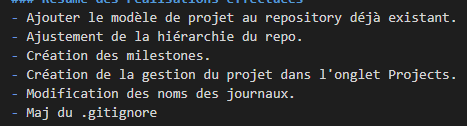
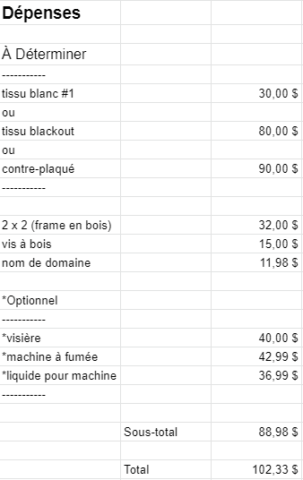
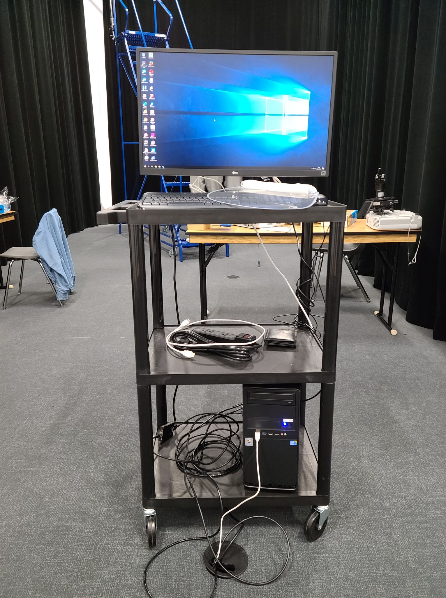
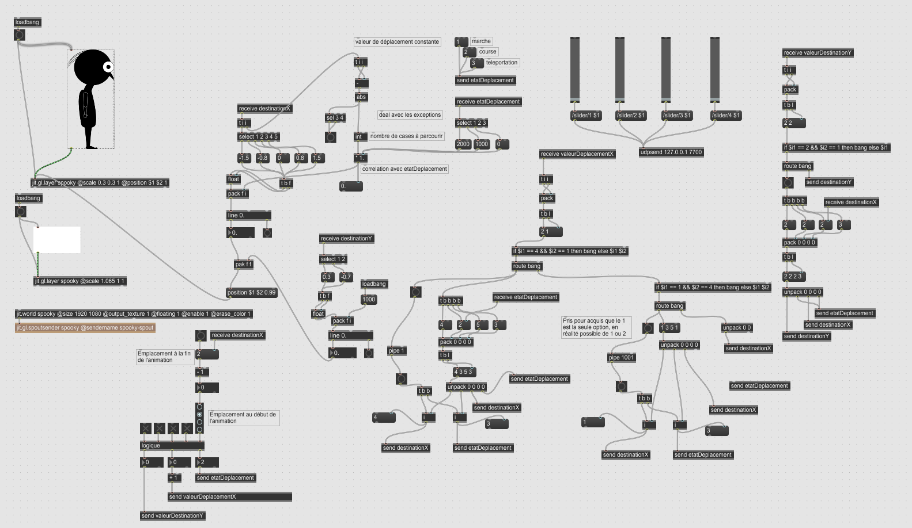
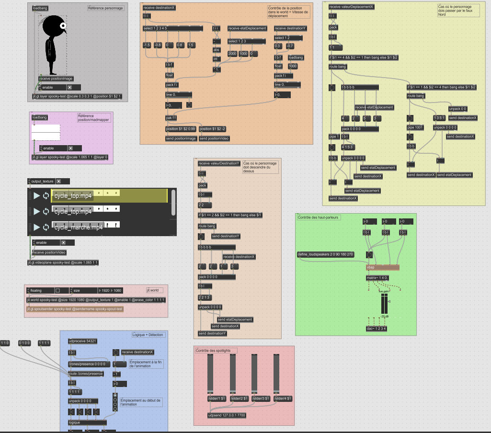

# Journal de William Racine

## Table des matières
- [Semaine 0 (25 au 29 janvier)](#Semaine-0-(25-au-29-janvier))
- [Semaine 1 (30 janvier au 5 février)](#Semaine-1-(30-janvier-au-5-février))
- [Semaine 2 (6 au 12 février)](#Semaine-2-(6-au-12-février))
- [Semaine 3 (13 au 19 février)](#Semaine-3-(13-au-19-février))
- [Semaine 4 (20 au 26 février)](#Semaine-4-(20-au-26-février))
- [Semaine 5 (6 au 12 mars)](#Semaine-5-(6-au-12-mars))
- [Semaine 6 (13 au 19 mars)](#Semaine-6-(13-au-19-mars))

---
## Semaine 0 (25 au 29 janvier)

### Résumé des réalisations effectuées
- Ajouter le modèle de projet au repository déjà existant.
- Ajustement de la hiérarchie du repo.
- Création des milestones.
- Création de la gestion du projet dans l'onglet Projects.
- Modification des noms des journaux.
- Maj du .gitignore.
- Compléter la semaine 0 de mon journal.
- Accorder les rôles de chaque personne de mon équipe.
- Avancer la préproduction

### Image d'une réalisation dont tu es la ou le plus fier

### Est-ce que j'ai accompli l'ensemble des tâches et objectifs que je m'étais fixés pour cette semaine?	
- [x] Complètement
- [ ] Assez
- [ ] Peu
- [ ] Pas du tout

#### Décrivez pourquoi.
Notre objectif de la semaine était de déterminer les rôles de chacun ainsi que de compléter la semaine 0 de notre journal. En plus de faire les objectifs demandés, j'ai modifier le repository pour qu'il répondre aux exigences du cours.

#### S'il y a lieu, qu'allez-vous faire pour remédier à la situation?

### Mon projet s'est-il réalisé selon l’échéancier prévu?

- [x] Complètement
- [ ] Assez
- [ ] Un peu
- [ ] Pas tout à fait

#### S'il y a des écarts, décrivez-les.

#### S'il y a lieu, qu'allez-vous faire pour remédier à la situation?

### Défis pour la prochaine semaine
- Essayer de trouver le plus d'issues réalisables pour les prochain(e)s jours/semaines
- Déterminer un budget

---
## Semaine 1 (30 janvier au 5 février)
### Résumé des réalisations effectuées
- Corriger la préproduction.
- Planifier un budget.
- Magasiner pour une surface de projection.

### Image d'une réalisation dont tu es la ou le plus fier

### Est-ce que j'ai accompli l'ensemble des tâches et objectifs que je m'étais fixés pour cette semaine?

- [x] Complètement
- [ ] Assez
- [ ] Peu
- [ ] Pas du tout

#### Décrivez pourquoi.
 J'ai compléter la correction de la partie de la préproduction que je m'occupais. De plus, j'ai appelé plsuieurs magasins de tissus pour déterminer nos options en terme de surface de projection.

#### S'il y a lieu, qu'allez-vous faire pour remédier à la situation?

### Mon projet s'est-il réalisé selon l’échéancier prévu?

- [x] Complètement
- [ ] Assez
- [ ] Un peu
- [ ] Pas tout à fait

#### S'il y a des écarts, décrivez-les.

#### S'il y a lieu, qu'allez-vous faire pour remédier à la situation?

### Défis pour la prochaine semaine
Après la validation de la préproduction, notre équipe va se lancer sur la réalisation du prototype. Il reste à déterminer quel prototype nous allons faire.

---
## Semaine 2 (6 au 12 février)
### Résumé des réalisations effectuées
- Correction de la partie 4 de la préproduction
- Modification du budget selon l'avancement du projet
- Montage des lumières test dans le grand studio
- Branchement de l'ordinatieur de contrôle
- Test de projection

### Image d'une réalisation dont tu es la ou le plus fier

### Est-ce que j'ai accompli l'ensemble des tâches et objectifs que je m'étais fixés pour cette semaine?

- [x] Complètement
- [ ] Assez
- [ ] Peu
- [ ] Pas du tout

#### Décrivez pourquoi.
Nous avons fait plusieurs tests de placement durant les 3 derniers jours de la semaine, ainsi que des tests d'éclairage.

#### S'il y a lieu, qu'allez-vous faire pour remédier à la situation?

### Mon projet s'est-il réalisé selon l’échéancier prévu?

- [x] Complètement
- [ ] Assez
- [ ] Un peu
- [ ] Pas tout à fait

#### S'il y a des écarts, décrivez-les.

#### S'il y a lieu, qu'allez-vous faire pour remédier à la situation?

### Défis pour la prochaine semaine
- Continuer montage de l'expérience
- Faire du travail personnel dans Max
- Tester Vbap pour le contrôle du son

---
## Semaine 3 (13 au 19 février)
### Résumé des réalisations effectuées
- Installation des projecteurs
- Mise en place du prototype de l'expérience
- Développement de la communication entre les projecteurs et Max avec Spout
- Mise à journal du journal et du repository

### Image d'une réalisation dont tu es la ou le plus fier

### Est-ce que j'ai accompli l'ensemble des tâches et objectifs que je m'étais fixés pour cette semaine?

- [ ] Complètement
- [x] Assez
- [ ] Peu
- [ ] Pas du tout

#### Décrivez pourquoi.
Nous nous sommes absenter quelques jours en raison de la santé d'un de nos coéquipiers

#### S'il y a lieu, qu'allez-vous faire pour remédier à la situation?
Attendre son bon rétablissement

### Mon projet s'est-il réalisé selon l’échéancier prévu?

- [x] Complètement
- [ ] Assez
- [ ] Un peu
- [ ] Pas tout à fait

#### S'il y a des écarts, décrivez-les.

#### S'il y a lieu, qu'allez-vous faire pour remédier à la situation?

### Défis pour la prochaine semaine
- Terminer le prototype de l'expérience
- Terminer la projection avec Spout
- Tester VBap

---
## Semaine 4 (20 au 26 février)
### Résumé des réalisations effectuées
- Finir prototype
- Réalisation d'une projection vidéo sur la surface de projection
- Création du module de contrôle des lumières
- Installation du module de détection (Kinect) ainsi que son module de contrôle (Rasberry)

### Image d'une réalisation dont tu es la ou le plus fier

### Est-ce que j'ai accompli l'ensemble des tâches et objectifs que je m'étais fixés pour cette semaine?

- [X] Complètement
- [ ] Assez
- [ ] Peu
- [ ] Pas du tout

#### Décrivez pourquoi.
J'ai été capable de compléter la projection de vidéo sur la surface de projection, ce qui est une étape plus avancé que ce que je voulais à la base. 

#### S'il y a lieu, qu'allez-vous faire pour remédier à la situation?

### Mon projet s'est-il réalisé selon l’échéancier prévu?

- [X] Complètement
- [ ] Assez
- [ ] Un peu
- [ ] Pas tout à fait

#### S'il y a des écarts, décrivez-les.

#### S'il y a lieu, qu'allez-vous faire pour remédier à la situation?

### Défis pour la prochaine semaine
- Installer le matériel de soutien pour les caméras de diffusion en direct
- Instaler le matériel de soutien pour les haut-parleurs

---
## Semaine de rattrapage (27 février au 5 mars)
### Résumé des réalisations effectuées
- Combiner plusieurs fichiers Max en un
- Organiser le Max en bloc
- Réorganiser le fichier pour la matrice
- Faire fonctionner la détection, envoyer les données dans Max et faire interagir la logique
- Installer le matériel de soutien pour les caméras de diffusion en direct
- Faire la spacialisation du son avec Max

### Image d'une réalisation dont tu es la ou le plus fier

### Est-ce que j'ai accompli l'ensemble des tâches et objectifs que je m'étais fixés pour cette semaine?

- [x] Complètement
- [ ] Assez
- [ ] Peu
- [ ] Pas du tout

#### Décrivez pourquoi.
J'ai grandement avancé dans le Max et nous avons réussi à faire fonctionner les haut-parleurs Divoom avec VBap

#### S'il y a lieu, qu'allez-vous faire pour remédier à la situation?

### Mon projet s'est-il réalisé selon l’échéancier prévu?

- [x] Complètement
- [ ] Assez
- [ ] Un peu
- [ ] Pas tout à fait

#### S'il y a des écarts, décrivez-les.

#### S'il y a lieu, qu'allez-vous faire pour remédier à la situation?

### Défis pour la prochaine semaine
- Terminer d'installer le matériel
- Avancer le plus possible dans la projection avec la tour terminée

---
## Semaine 5 (6 au 12 mars)
### Résumé des réalisations effectuées
- Avancer la logique
- Avancer la projection sur la tour
- Aider avec la diffusion vidéo

### Image d'une réalisation dont tu es la ou le plus fier

### Est-ce que j'ai accompli l'ensemble des tâches et objectifs que je m'étais fixés pour cette semaine?

- [x] Complètement
- [ ] Assez
- [ ] Peu
- [ ] Pas du tout

#### Décrivez pourquoi.
Tout le matériel est installé et j'ai pu travailler sur la projection sur la tour finale

#### S'il y a lieu, qu'allez-vous faire pour remédier à la situation?

### Mon projet s'est-il réalisé selon l’échéancier prévu?

- [x] Complètement
- [ ] Assez
- [ ] Un peu
- [ ] Pas tout à fait

#### S'il y a des écarts, décrivez-les.

#### S'il y a lieu, qu'allez-vous faire pour remédier à la situation?

### Défis pour la prochaine semaine
- Finir la logique
- Ajuster la projection

---
## Semaine 6 (13 au 19 mars)
### Résumé des réalisations effectuées

### Image d'une réalisation dont tu es la ou le plus fier

### Est-ce que j'ai accompli l'ensemble des tâches et objectifs que je m'étais fixés pour cette semaine?

- [ ] Complètement
- [ ] Assez
- [ ] Peu
- [ ] Pas du tout

#### Décrivez pourquoi.
 

#### S'il y a lieu, qu'allez-vous faire pour remédier à la situation?

### Mon projet s'est-il réalisé selon l’échéancier prévu?

- [ ] Complètement
- [ ] Assez
- [ ] Un peu
- [ ] Pas tout à fait

#### S'il y a des écarts, décrivez-les.

#### S'il y a lieu, qu'allez-vous faire pour remédier à la situation?

### Défis pour la prochaine semaine
