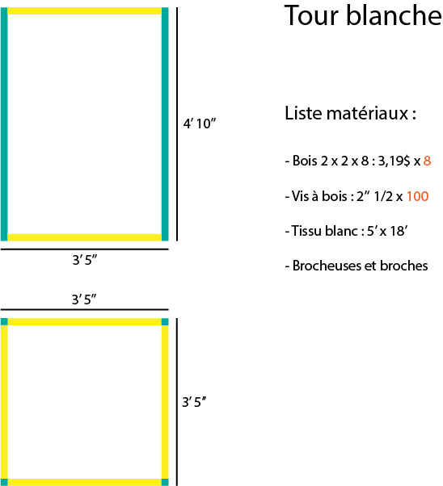

# Préproduction
> C'est ici qu'on dépose les éléments de la préproduction.

> Au besoin, se référer à l'[Appel de projet](https://cmontmorency365.sharepoint.com/:w:/s/TIM-58266B-Expriencemultimdiainteractive-Enseignants/EQ3PqvTQPzFDnpeccqWYOAgBZowMn5-3gtl0I_OxsEGC-Q?e=DuUbuG), au [Plan de cours](https://cmontmorency365.sharepoint.com/:w:/s/TIM-58266B-Expriencemultimdiainteractive-Enseignants/EWLLhctc9WZJiDCSjlMXcFoBA9fMhQRS4PHbGXHCH2Irxw?e=qGOnLf) et à la [Grille d'évaluation de la préproduction](https://cmontmorency365.sharepoint.com/:w:/s/TIM-58266B-Expriencemultimdiainteractive-Enseignants/ETcbkxD6vp1EmhhiZ3Di5_sBZwSyqisa7s3543kMy28dSg?e=gnu6Bt).

# Table des matières
1. [Intention ou concept](#Intention-ou-concept)
    - [Synopsis](#Synopsis)
    - [Intention de départ](#Intention-de-départ)
    - [Tableau d'ambiance (*moodboard*)](#Tableau-d'ambiance-(*moodboard*))
    - [Scénario, scénarimage ou document audio/visuel](#Scénario,-scénarimage-ou-document-audio/visuel)
2. [Contenu multimédia à intégrer](#Contenu-multimédia-à-intégrer)
    - [Inventaire du contenu multimédia](#Inventaire-du-contenu-multimédia)
    - [Univers artistique des éléments](#Univers-artistique-des-éléments-centraux)
3. [Planification technique (devis technique)](#Planification-technique-(devis-technique))
    - [Schémas ou plans techniques](#Schémas-ou-plans-techniques)
    - [Matériaux requis](#Matériaux-de-scénographie-requis)
    - [Équipements requis](#Équipements-requis)
    - [Logiciels requis](#Logiciels-requis)
    - [Ressources humaines requises](#Ressources-humaines-requises)
    - [Ressources spatiales requises (rangement et locaux)](#Ressources-spatiales-requises-(rangement-et-locaux))
4. [Planification de la production (budget et étapes de réalisation)](#Planification-de-la-production-(budget-et-étapes-de-réalisation))
    - [Budget prévisionnel](#Budget-prévisionnel)
    - [Échéancier global](#Échéancier-global)
    - [Liste des tâches à réaliser](#Liste-des-tâches-à-réaliser)
    - [Rôles et responsabilités des membres de l'équipe](#Rôles-et-responsabilités-des-membres-de-l'équipe)
    - [Moments des rencontres d'équipe](#Moments-des-rencontres-d'équipe)

# Intention ou concept
## Synopsis
Un personnage est présent sur une face d'une tour à cinq faces. Il est effrayé lorsque quelqu'un est devant lui et change de face à la course jusqu'à devoir se réfugier sur le dessus. 

Le public est invité à se positionner devant chacune des faces pour faire fuir le personnage vers le dessus de la tour.

## Intention de départ
Par ce projet, nous souhaitons mettre l'accent sur l'anxiété et le stress de certains individus face aux foules. Il s'agit d'un regard sur la face opposé du confinement où beaucoup ne se sentent pas à l'aise d'être seuls chez eux. Exactement comme certains ne se sentent pas à l'aise quand ils sont à l'extérieur avec d'autres gens.

## Tableau d'ambiance (*moodboard*)

Lien vers extrait audio intéressant d'ambiance sonnor 
39:25​ – Lumberjack of Redfire Forest
46:37​ – Town of Fables
https://www.youtube.com/watch?v=MfwOJWDj18k

Ici, je reprendrais une ligne de basse dans le genre. La guitare est bien, mais trop intense pour un ambiance. 
https://www.youtube.com/watch?v=Go7WoT8pSWg&list=PLj3oPX9ORL9MZd9j0R-EjqLT1a0yO6YoM

## Scénario, scénarimage ou document audio/visuel
Une tour d’une hauteur d’environ 5’ est placé au centre d’une pièce. Un personnage est présent sur l’une des cinq surfaces de la tour (les face qui sont visibles). Lorsqu’un individu se place devant la même surface que le personnage, celui-ci changera de surface. Le personnage continuera de s’enfuir tant qu’il y aura un individu qui sera en face de lui. Si les quatre faces latérales de la tour sont occupées par des individus, le personnage sera forcé de se rendre au sommet de la tour pour un certain moment pour finalement redescendre et ainsi de suite.
En fait, un capteur est placé au-dessus de la tour pour détecter les participants qui se trouvent potentiellement devant une des faces de la tour. Après qu’une détection ait été fait, le personnage changera de surface. En d’autres mots, la détection d’un individu va envoyer un message au système et déclenchera une animation. 
Par ailleurs, étant donné que l’expérience sera également disponible sur le web, les participants à distance pourront également faire déplacer le personnage grâce à un système de vote en ligne. Les participants en ligne pourront décider la prochaine présence(fictive) à avoir face à la tour.

# Contenu multimédia à intégrer
## Inventaire du contenu multimédia

[Inventaire du contenu à intégrer](https://docs.google.com/spreadsheets/d/1OvP3xgN0axjtxIeO2JyGzZx_uvsgmqFpQghbXrXnPnE/edit?usp=sharing})

## Univers artistique des éléments
Voir colonne *Exemples de réalisation* dans l'[Inventaire du contenu à intégrer](https://cmontmorency365.sharepoint.com/sites/TIM-58266B-Expriencemultimdiainteractive-Enseignants/_layouts/15/Doc.aspx?OR=teams&action=edit&sourcedoc={8D242B82-E599-49CF-BE4C-EA9539D2D1C3}).

# Planification technique (devis technique)
## Schémas ou plans techniques

### Schéma de branchement 

### Plantation 

## Matériel de scénographie requis

Tour blanche

## Équipements requis

[Lien vers document d'emprunt de matériel](https://drive.google.com/file/d/1lWa3psT-4P8tG6VKvaLpJB6fhlNFTs35/view?usp=sharing)

* Audio
    * 4 Haut-parleurs bluetooth DIVOOM AIRBEAT-10
    * 4 Hauts-parleurs Genelec 8010 8"
    * 1 Carte de son Berhinger U-Phoria 8 in 8 out

* Vidéo
    * 2 Projecteur standard, ratio 1.5, 3500 lumens
    * 1 Kinect V1
    * 4 Caméra - Sony A6000

* Lumière
    * 4 Chauvet slimPAR Pro USB
    * 1 Chauvet Obey 40 - Controlleur DMX

* Câbles
    * 8 câble XLR 25'
    * 5 câble ethernet 25'
    * 1 Usb vers xlr
    * 6 Extenders HDMI
    * 4 Adaptateur 1/8 femelle trs vers 1/4 male trs
    * 4 câble 1/8 6'

* Électricité
    * 2 multiprises
    * 2 extensions 25'

* Réseau
    * 2 câble ethernet 25'

* Ordinateur
    * 1 Desktop chariot mobile
    * MadMapper
    * Max 8
    * OBS
    
* Autre
    * 1 Machine à fumée
    * 2 Système d'accrochage pour projecteurs
    * 4 Cheezboro pour haut-parleurs genelec
    * 14 Câble de sécurité
    * 8 Système de fixation extensible 5' à 10'
    * 2 Tige accrochage 3'

## Logiciels requis

* [Max 8](https://cycling74.com/products/max)
* [MadMapper](https://madmapper.com)
* [Open stage control](https://openstagecontrol.ammd.net/)
* [Open Broadcaster Software](https://obsproject.com)
* [After Effect](https://www.adobe.com/ca/products/aftereffects.html)
* [Illustrator](https://www.adobe.com/ca/products/illustrator.html)
* [Photoshop](https://www.adobe.com/ca/products/photoshop.html)
* [Reaper](https://www.reaper.fm)
* [Filezilla](https://filezilla-project.org)
* [draw.io](https://app.diagrams.net)

## Ressources humaines requises

Location d'équipement :
* 10 février, TTP, location de matériel 
* 26 mars, TTP, retour du matériel

Accrochage : 
* 11 février, équipe, montage de l'expérience
* 26 mars, équipe, démontage de l'expérience

## Ressources spatiales requises (rangement et locaux)

* Grand studio
    * 10 février au 18 mars 
        * Installation de l'expérience
        * Résolution des problèmes
        * Multiples tests et essais

    * 19 mars au 25 mars
        * Pratique et diffusion

* Salle des matrices
    * 10 février au 25 mars
        * DMX
        * Patch
        * Ordinateur desktop chariot
    
# Planification de la production (budget et étapes de réalisation)
## Budget prévisionnel

[Lien vers document](https://docs.google.com/spreadsheets/d/1kHZWbiHMfSaipFloLJ8W2hEs6XVXDz1Rte_uiNLSNUQ/edit#gid=0)

## Échéancier global
Étapes importantes du projet visualisé dans GitHub (*milestones*):  
https://github.com/Quollector/Spooky-tower/milestones

*Dates importantes de diffusion :*
- Pratique générale : 19 mars (toute la journée)
- Début de la diffusion : lundi 22 mars
- Présentation des projets devant public : jeudi 25 mars (soir)

## Liste des tâches à réaliser
Visualisation des tâches à réaliser dans GitHub selon la méthode Kanban:  
https://github.com/Quollector/Spooky-tower/projects/2

Inventaire des tâches à réaliser dans GitHub selon le répertoire d'*issues*:  
https://github.com/Quollector/Spooky-tower/issues

## Rôles et responsabilités des membres de l'équipe

### **William Racine**
- **Coordination générale du projet (coordination de l'échéancier, du budget, suivi de la liste des tâches à réaliser, s'assurer de la répartition du rôle et des responsabilités des membres de l'équipe);**
- **Comité Diffusion**
- Création du module d'interprétation des données;
- Programmation du module Max de contrôle vidéo.
- Programmation de la logique du projet.
- Installation de l'équipement dans l'espace physique

Liste des tâches dans Git Hub:  
https://github.com/Quollector/Spooky-tower/issues/assigned/Aermyx 
https://github.com/Quollector/Spooky-tower/projects/2?card_filter_query=assignee%3Aaermyx

### **Antoine Allard**
- **Comité Technique et coordination technique (suivi du devis technique);**
- Plan des équipements et câblage
- Plan des connections entre les les différents équipement et la régie
- Montage de la scène et test des positions de l'équipement

Liste des tâches dans Git Hub:  
https://github.com/Quollector/Spooky-tower/issues/assigned/AntoAllard
https://github.com/Quollector/Spooky-tower/projects/2?card_filter_query=assignee%3Aantoallard

### **Quentin Lequenne**
- **Comité Diffusion et coordination de la diffusion (mise en ligne du Site Web, organisation de la plateforme et de l'événement de diffusion);**
- Programmation du module de captation des données;
- Programmation du module de diffusion et d'interaction en ligne (page Web, diffusion vidéo dans Twitch via OBS, interface utilisateur dans Open Stage Control).
- Installation de l'équipement dans l'espace physique.

Liste des tâches dans Git Hub:  
https://github.com/Quollector/Spooky-tower/issues/assigned/Quollector
https://github.com/Quollector/Spooky-tower/projects/2?card_filter_query=assignee%3Aquollector

### **Félix Jasmin**
- **Coordination artistique (attention plus particulière pour s'assurer que l'intention/concept artistique du projet initial reste, sinon consulter les membres de l'équipe);**
- Création des paysages sonores sonores;
- Programmation du module Max d'effet et de contrôle audio;
- Installation de l'équipement dans l'espace physique.

Liste des tâches dans Git Hub:  
https://github.com/Quollector/Spooky-tower/issues/assigned/felixjasmin
https://github.com/Quollector/Spooky-tower/projects/2?card_filter_query=assignee%3Afelixjasmin

**Tâches pas encore attribuées**  
https://github.com/Quollector/Spooky-tower/issues?q=is%3Aopen+is%3Aissue+no%3Aassignee

## Moments des rencontres d'équipe
Quotidien
- **Chaque jour 13h00 (30min max)**: Rencontre statutaire d'équipe pour régler les urgences

Hebdomadaire
- **Mardi 10h (environ 1h)** : Rencontre d'équipe avec professeur
- **Vendredi 9h50 (environ 2h)** : Rencontre générale de classe
- **Vendredi 13h (environ 2h)** : Rencontre de mise à jour d'équipe (Journal Web, suivis, mise à jour de l'échéancier, partage des tâches et autres)

Autre: 
- **Jeudi 10h (environ 1h30)** : Comité Diffusion
- **Jeudi 14h (environ 1h30)** : Comité Technique
